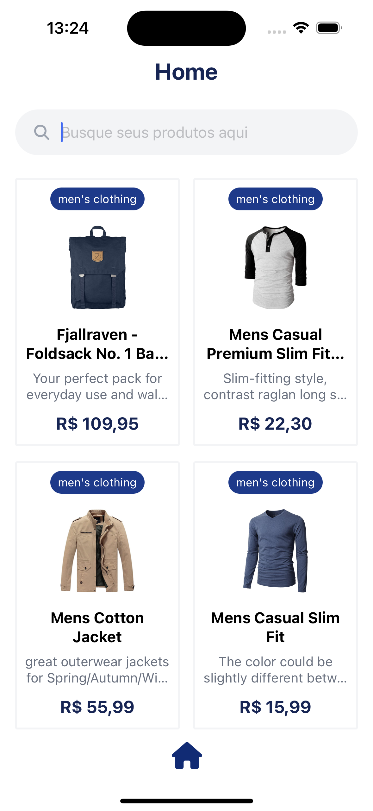
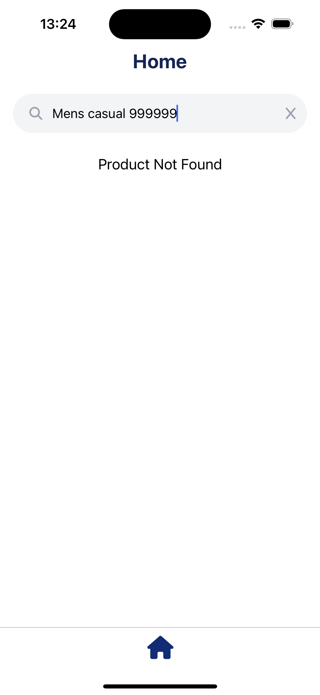

## 💻 Projeto

Página de produtos feita com React Native (utilizando expo).
- Funcionalidades
  - Integração com a FakeStoreAPI para listagem de produtos utilizando axios
  - Desenvolvido um campo de busca onde o usuário pode buscar/filtrar produtos através do texto digitado
  - Testes unitários nos componentes
  - Utilizado Font Awesome para display dos ícones

- Extras
  - Limpar busca/filtro
  - Exibir mensagem de "Produto não encontrado" após buscar um produto inexistente na lista
  - Componente de Loading

- Dicas/Melhorias futuras
 - Melhorar performance com paginação na listagem (FlatList) conforme scroll - (porém, a FakeStoreAPI ainda não possui o recurso de paginação).
 - Criar PDP (Página do Produto)

## 🛠️ Stack

- Mobile
  - React Native (expo)
  - NativeWind
  - ESLint + Prettier Tailwind
  - Unit test: Jest / Testing-library
  - React navigation
  - Axios

## APP

## RUN
Clone - git@github.com:leopacciulli/products-list.git